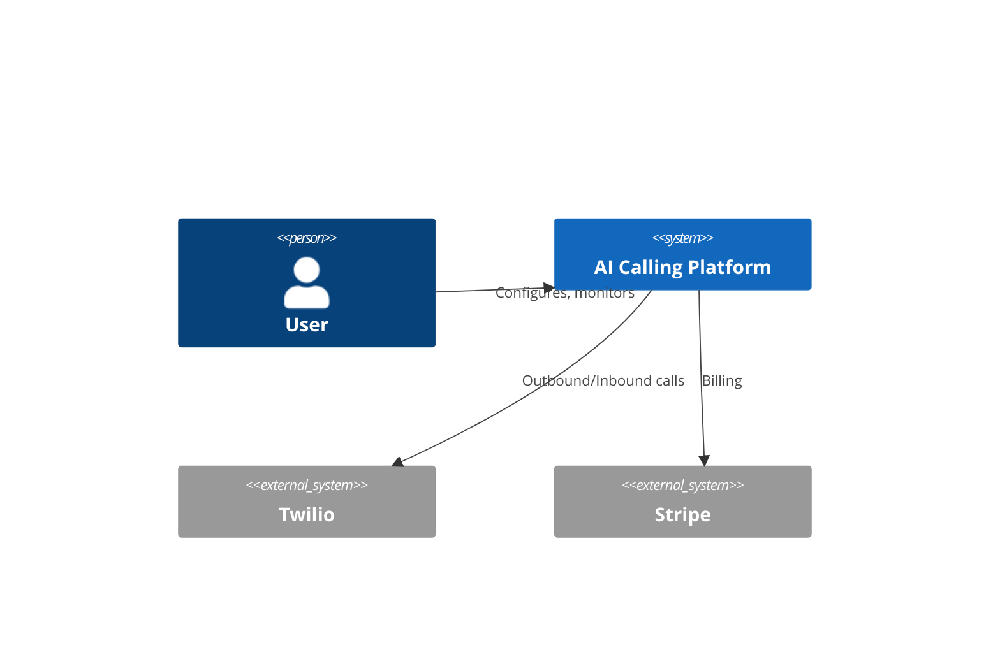
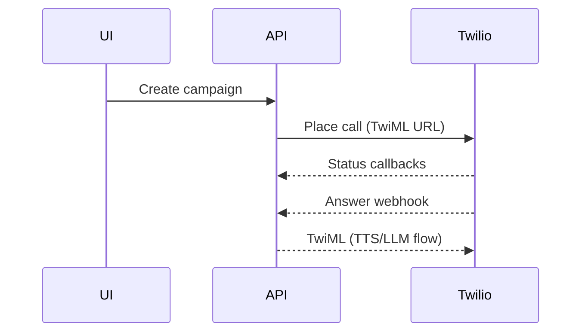

### High-Level Overview
- Multi-tenant no-code platform for automated AI calling agents.

### C4 Context

```mermaid
C4Context
	Person(user, "User")
	System(system, "AI Calling Platform")
	System_Ext(twilio, "Twilio")
	System_Ext(stripe, "Stripe")
	Rel(user, system, "Configures, monitors")
	Rel(system, twilio, "Outbound/Inbound calls")
	Rel(system, stripe, "Billing")
```

### Sequence: Outbound Call

```mermaid
sequenceDiagram
	participant UI
	participant API
	participant Twilio
	UI->>API: Create campaign
	API->>Twilio: Place call (TwiML URL)
	Twilio-->>API: Status callbacks
	Twilio-->>API: Answer webhook
	API-->>Twilio: TwiML (TTS/LLM flow)
```